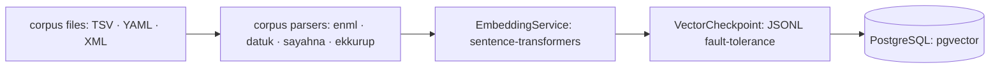
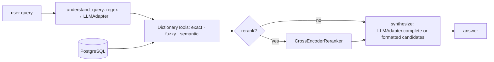
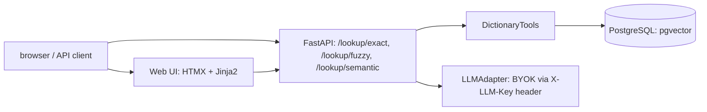
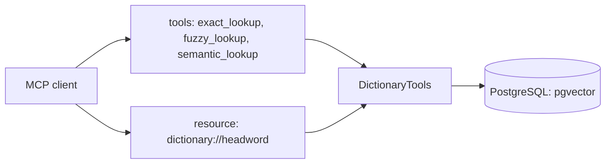

# Architecture

Four independent subsystems share the same Postgres + pgvector database:
the **ingestion pipeline**, the **RAG pipeline**, the **REST API / web UI**, and the **MCP server**.

Four corpora are active: **Olam** (EN→ML), **Datuk** (ML→ML), **Shabdataaravali / Sayahna** (ML→ML, classical 1917 dictionary), and **Ekkurup** (EN→ML thesaurus). Each corpus is wired via a `parser._target_` entry in `config/corpus/all.yaml`; no Python code change is needed to add a new corpus.

---

## Ingestion



Checkpoint-based — restarts safely after a crash without re-embedding already-vectorised entries.

---

## RAG pipeline



`understand_query` tries regex patterns first and only calls the LLM adapter for unrecognised phrasings.
When `llm=nollm`, synthesis skips the LLM and returns formatted top-k candidates directly.

---

## REST API and web UI



Deployed at [linguaalayam.org](https://linguaalayam.org) — Hetzner CX33, Docker Compose, nginx reverse proxy, Let's Encrypt HTTPS.
LLM synthesis is opt-in: the user supplies their own API key in the browser settings page; the key is never persisted server-side.

---

## MCP server



No LLM involvement — pure retrieval. The embedding model loads once at startup.

---

## Module reference

| Module | Purpose |
|---|---|
| `linguaalayam/models/entries.py` | Entry types (`OlamEntry`, `DatukEntry`, `SayahnaEntry`, `EkkurupEntry`), each with `to_embed_text()` |
| `linguaalayam/models/orm.py` | SQLAlchemy `DictionaryEntry` ORM — headword, embed_text, JSONB data, Vector(768) |
| `linguaalayam/corpus/base.py` | `parse_definition_tsv()` — shared 3-column TSV helper used by `enml.py` and `datuk.py` |
| `linguaalayam/corpus/` | One parser per corpus (`enml.py`, `datuk.py`, `sayahna.py`, `ekkurup.py`), each exposes `parse()` |
| `linguaalayam/embeddings/service.py` | `EmbeddingService` — wraps sentence-transformers, exposes `batch_size` and `vector_size` |
| `linguaalayam/database/queries.py` | `batch_insert()`, `similarity_search()` (HNSW cosine), `get_ingested_headwords()`; all search functions accept `source: str \| list[str] \| None` |
| `linguaalayam/llm/adapters/` | `LLMAdapter` ABC + `AnthropicAdapter`, `OpenAIAdapter`, `NoLLMAdapter` |
| `linguaalayam/rag/pipeline.py` | LangGraph graph: understand → retrieve → rerank? → synthesize |
| `linguaalayam/rag/tools.py` | `DictionaryTools` — exact, fuzzy, semantic lookup over a live DB session |
| `linguaalayam/mcp/server.py` | FastMCP server — three tools + `dictionary://{headword}` resource |
| `linguaalayam/scripts/ingest.py` | Ingestion entry point; corpus parsers injected via Hydra `_target_` — no hardcoded parser map |
| `linguaalayam/translation/` | `TranslationService` ABC + `MarianTranslationService` (Helsinki-NLP/opus-mt-mul-en); lazy-loaded, translates non-EN/ML input to English before search |
| `linguaalayam/morphology.py` | `analyse_word()` — mlmorph-based Malayalam morphological analyser; LRU-cached, handles archaic chillu normalisation |
| `linguaalayam/env.py` | Centralised env loader; reads secrets from Windows Credential Manager on WSL, falls back to `.env` |
| `config/` | Hydra config groups: `corpus` (with per-source `parser._target_`), `embedding`, `database`, `llm`, `rag` |
| `migrations/` | Alembic schema migrations |

---

## Tech stack

| Layer | Choice |
|---|---|
| Language | Python 3.11+ |
| DB | PostgreSQL + pgvector (local Docker) |
| ORM / migrations | SQLAlchemy 2.0, Alembic |
| Embeddings | sentence-transformers (`paraphrase-multilingual-mpnet-base-v2`) |
| RAG graph | LangGraph + LangChain |
| LLM | Anthropic Claude or OpenAI via `LLMAdapter`; `NoLLMAdapter` for zero-key usage |
| REST API / Web UI | FastAPI, HTMX, Jinja2 |
| MCP | FastMCP (`mcp` SDK) |
| Deployment | Docker Compose, nginx, Let's Encrypt (Hetzner CX33) |
| Config | Hydra |
| Testing | pytest, ruff, pre-commit |

---

## API examples

Query understanding — regex-based, no external dependencies:

```python
from linguaalayam.rag.query_understanding import understand_query

result = understand_query("define serendipity")
assert result.headword == "serendipity"
assert result.intent == "define"

result = understand_query("translate water to malayalam")
assert result.intent == "translate"
```

LLM adapters — the `NoLLMAdapter` needs no API key:

```python
from linguaalayam.llm.adapters.nollm import NoLLMAdapter

adapter = NoLLMAdapter()
assert not adapter.has_llm
```

Entry text representations:

```python
from linguaalayam.models.entries import OlamEntry, DatukEntry, SayahnaEntry, EkkurupEntry, EkkurupSense

entry = OlamEntry(headword="run", definitions=[("v", "ഓടുക")])
text = entry.to_embed_text()
assert text.startswith("word: run")
assert "ഓടുക" in text

ml_entry = DatukEntry(headword="ഓടുക", definitions=[("v", "വേഗത്തിൽ ചലിക്കുക")])
ml_text = ml_entry.to_embed_text()
assert "ഓടുക" in ml_text

say_entry = SayahnaEntry(headword="അംശം", definitions=[(None, "ഭാഗം")], explanations=["സ്ത്രീ: അംശിനി."])
say_text = say_entry.to_embed_text()
assert "അംശം" in say_text
assert "notes:" in say_text

ek_entry = EkkurupEntry(
    headword="run",
    senses=[EkkurupSense(pos="verb", en=[["sprint", "dash"]], ml=[["ഓടുക"]])],
)
ek_text = ek_entry.to_embed_text()
assert "[verb]" in ek_text
assert "sprint" in ek_text
assert "ഓടുക" in ek_text
```
