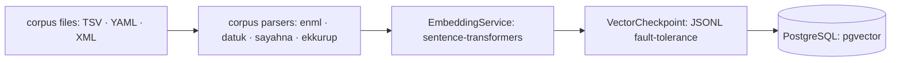
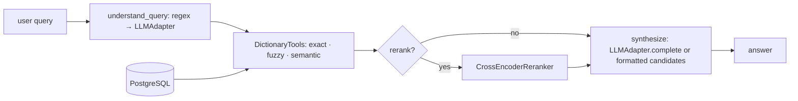
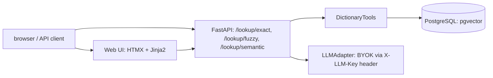
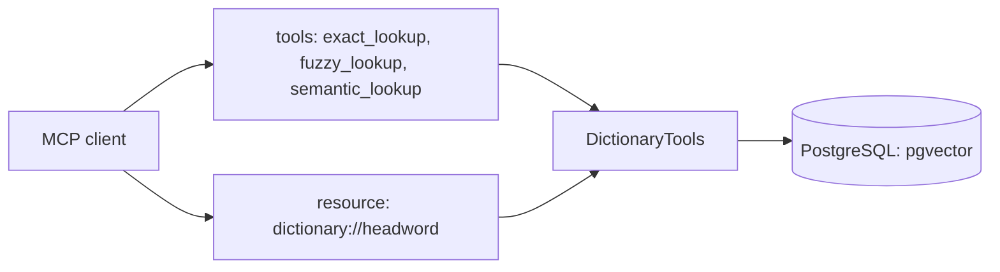
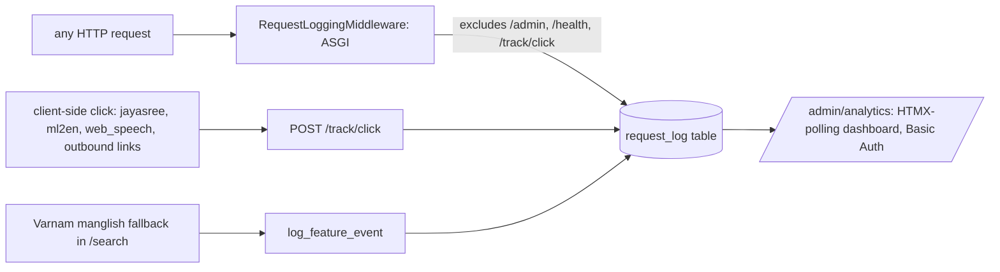

# Architecture

Five independent subsystems share the same Postgres + pgvector database:
the **ingestion pipeline**, the **RAG pipeline**, the **REST API / web UI**, the **MCP server**, and **observability**.

Four corpora are active: **Olam** (EN→ML), **Datuk** (ML→ML), **Shabdataaravali / Sayahna** (ML→ML, classical 1917 dictionary), and **Ekkurup** (EN→ML thesaurus). Each corpus is wired via a `parser._target_` entry in `config/corpus/all.yaml`; no Python code change is needed to add a new corpus.

---

## Ingestion


```mermaid
flowchart LR
    A[corpus files: TSV · YAML · XML] --> B[corpus parsers: enml · datuk · sayahna · ekkurup]
    B --> C[EmbeddingService: sentence-transformers]
    C --> D[VectorCheckpoint: JSONL fault-tolerance]
    D --> E[(PostgreSQL: pgvector)]
```

Checkpoint-based — restarts safely after a crash without re-embedding already-vectorised entries.

---

## RAG pipeline


```mermaid
flowchart LR
    Q[user query] --> U[understand_query: regex → LLMAdapter]
    U --> DT[DictionaryTools: exact · fuzzy · semantic]
    DT --> R{rerank?}
    R -- yes --> RR[CrossEncoderReranker]
    R -- no --> S
    RR --> S[synthesize: LLMAdapter.complete or formatted candidates]
    DB[(PostgreSQL)] --> DT
    S --> A[answer]
```

`understand_query` tries regex patterns first and only calls the LLM adapter for unrecognised phrasings.
When `llm=nollm`, synthesis skips the LLM and returns formatted top-k candidates directly.

---

## REST API and web UI


```mermaid
flowchart LR
    B[browser / API client] --> F[FastAPI: /lookup/exact, /lookup/fuzzy, /lookup/semantic]
    B --> W[Web UI: HTMX + Jinja2]
    F --> DT[DictionaryTools]
    W --> F
    DT --> DB[(PostgreSQL: pgvector)]
    F --> L[LLMAdapter: BYOK via X-LLM-Key header]
```

Deployed at [linguaalayam.org](https://linguaalayam.org) — Hetzner CX33, Docker Compose, nginx reverse proxy, Let's Encrypt HTTPS.
LLM synthesis is opt-in: the user supplies their own API key in the browser settings page; the key is never persisted server-side.

---

## MCP server


```mermaid
flowchart LR
    C[MCP client] --> T[tools: exact_lookup, fuzzy_lookup, semantic_lookup]
    C --> R[resource: dictionary://headword]
    T & R --> DT[DictionaryTools]
    DT --> DB[(PostgreSQL: pgvector)]
```

No LLM involvement — pure retrieval. The embedding model loads once at startup.

---

## Observability


```mermaid
flowchart LR
    REQ[any HTTP request] --> MW[RequestLoggingMiddleware: ASGI]
    MW -- excludes /admin, /health, /track/click --> RL[(request_log table)]
    CLICK[client-side click: jayasree, ml2en, web_speech, outbound links] --> TC[POST /track/click]
    TC --> RL
    VARNAM[Varnam manglish fallback in /search] --> FE[log_feature_event]
    FE --> RL
    RL --> AD[/admin/analytics: HTMX-polling dashboard, Basic Auth/]
```

Every inbound request is logged once, classified into a `route_type` (`web_search`, `lookup_*`, `mcp`, `mcp_setup_page`, `api_docs`, `outbound_click`, `jayasree`, `ml2en`, `web_speech`, `varnam`, …). Client-side interactions with no server route of their own (or that would otherwise be misclassified, like a romanise-toggle re-triggering `/search`) are reported via a `sendBeacon` to `POST /track/click`, validated against a label allow-list. The dashboard at `/admin/analytics` is gated by HTTP Basic Auth and never publicly linked.

---

## Module reference

| Module | Purpose |
|---|---|
| `linguaalayam/models/entries.py` | Entry types (`OlamEntry`, `DatukEntry`, `SayahnaEntry`, `EkkurupEntry`), each with `to_embed_text()` |
| `linguaalayam/models/orm.py` | SQLAlchemy `DictionaryEntry` ORM — headword, embed_text, JSONB data, Vector(768) |
| `linguaalayam/corpus/base.py` | `parse_definition_tsv()` — shared 3-column TSV helper used by `enml.py` and `datuk.py` |
| `linguaalayam/corpus/` | One parser per corpus (`enml.py`, `datuk.py`, `sayahna.py`, `ekkurup.py`), each exposes `parse()` |
| `linguaalayam/embeddings/service.py` | `EmbeddingService` — wraps sentence-transformers, exposes `batch_size` and `vector_size` |
| `linguaalayam/database/queries.py` | `batch_insert()`, `similarity_search()` (HNSW cosine), `get_ingested_headwords()`; all search functions accept `source: str \| list[str] \| None` |
| `linguaalayam/llm/adapters/` | `LLMAdapter` ABC + `AnthropicAdapter`, `OpenAIAdapter`, `TogetherAIAdapter` (Qwen 3.5 9B via TogetherAI), `NoLLMAdapter`. All accept optional `api_key` kwarg; fall back to env vars (`ANTHROPIC_API_KEY`, `OPENAI_API_KEY`, `TOGETHER_API_KEY`). |
| `linguaalayam/rag/pipeline.py` | LangGraph graph: understand → retrieve → rerank? → synthesize |
| `linguaalayam/rag/tools.py` | `DictionaryTools` — exact, fuzzy, semantic lookup over a live DB session |
| `linguaalayam/mcp/server.py` | FastMCP server — three tools + `dictionary://{headword}` resource |
| `linguaalayam/scripts/ingest.py` | Ingestion entry point; corpus parsers injected via Hydra `_target_` — no hardcoded parser map |
| `linguaalayam/translation/` | `TranslationService` ABC + `MarianTranslationService` (Helsinki-NLP/opus-mt-mul-en); lazy-loaded via `build_translation_service()`, translates non-EN/ML input to English before search. Built in `app.py` lifespan, exposed through `get_translator()` in `api/dependencies.py`. |
| `linguaalayam/templates/` | Jinja2 templates served by the web router (`api/web.py`). `base.html` provides the shared layout with i18n helpers. `index.html` is the main search page (HTMX-driven). `partials/results.html` renders search results and AI answers. User API keys and AI-synthesis/language preferences live in the settings sidebar in `base.html` (`/settings` just redirects to `/?settings=1` to open it — no standalone template). All CSS is inline per-template — no external stylesheets. HTMX partials are returned from `/search` and re-render `#results`. |
| `linguaalayam/transliteration/core.py` | `is_latin_script()`, `malayalam_to_roman()`, `normalize_roman()`, `roman_to_malayalam_candidates()` — formal romanisation schemes |
| `linguaalayam/transliteration/morphology.py` | `analyse_word()` — mlmorph-based Malayalam morphological analyser; LRU-cached, handles archaic chillu normalisation; computed once at ingest time and stored on `DatukEntry`/`SayahnaEntry` |
| `linguaalayam/transliteration/varnam.py` | `manglish_to_malayalam()` — Varnam API client for informal Manglish transliteration; falls back to `core.roman_to_malayalam_candidates()` when unavailable |
| `linguaalayam/env.py` | Centralised env loader; reads secrets from Windows Credential Manager on WSL, falls back to `.env` |
| `linguaalayam/observability/` | `RequestLog` ORM model, `RequestLoggingMiddleware` (ASGI), `log_feature_event()`, and query helpers backing `/admin/analytics` |
| `linguaalayam/api/admin.py` | `/admin/analytics` dashboard + HTMX partial, HTTP Basic Auth via `ADMIN_USER`/`ADMIN_PASSWORD` |
| `linguaalayam/static/vendor/jayasree/` | Vendored from the [`jayasree`](https://github.com/sachn1/jayasree) npm package by `scripts/sync_jayasree.sh` (`make sync-jayasree`); not committed — regenerated at build time from `package.json`. Powers the per-word handwriting trace button on Malayalam headwords, lazy-loaded client-side |
| `config/` | Hydra config groups: `corpus` (with per-source `parser._target_`), `embedding`, `database`, `llm`, `rag` |
| `migrations/` | Alembic schema migrations |

---

## Tech stack

| Layer | Choice |
|---|---|
| Language | Python 3.11+ |
| DB | PostgreSQL + pgvector (local Docker) |
| ORM / migrations | SQLAlchemy 2.0, Alembic |
| Embeddings | sentence-transformers (`paraphrase-multilingual-mpnet-base-v2`) |
| RAG graph | LangGraph + LangChain |
| LLM | TogetherAI (Qwen 3.5 9B) default; Anthropic Claude, OpenAI via `LLMAdapter`; `NoLLMAdapter` for zero-key usage |
| REST API / Web UI | FastAPI, HTMX, Jinja2 |
| MCP | FastMCP (`mcp` SDK) |
| Deployment | Docker Compose, nginx, Let's Encrypt (Hetzner CX33) |
| Config | Hydra |
| Testing | pytest, ruff, pre-commit |

---

## API examples

Query understanding — regex-based, no external dependencies:

```python
from linguaalayam.rag.query_understanding import understand_query

result = understand_query("define serendipity")
assert result.headword == "serendipity"
assert result.intent == "define"

result = understand_query("translate water to malayalam")
assert result.intent == "translate"
```

LLM adapters — the `NoLLMAdapter` needs no API key:

```python
from linguaalayam.llm.adapters.nollm import NoLLMAdapter

adapter = NoLLMAdapter()
assert not adapter.has_llm
```

Entry text representations:

```python
from linguaalayam.models.entries import OlamEntry, DatukEntry, SayahnaEntry, EkkurupEntry, EkkurupSense

entry = OlamEntry(headword="run", definitions=[("v", "ഓടുക")])
text = entry.to_embed_text()
assert text.startswith("word: run")
assert "ഓടുക" in text

ml_entry = DatukEntry(headword="ഓടുക", definitions=[("v", "വേഗത്തിൽ ചലിക്കുക")])
ml_text = ml_entry.to_embed_text()
assert "ഓടുക" in ml_text

say_entry = SayahnaEntry(headword="അംശം", definitions=[(None, "ഭാഗം")], explanations=["സ്ത്രീ: അംശിനി."])
say_text = say_entry.to_embed_text()
assert "അംശം" in say_text
assert "notes:" in say_text

ek_entry = EkkurupEntry(
    headword="run",
    senses=[EkkurupSense(pos="verb", en=[["sprint", "dash"]], ml=[["ഓടുക"]])],
)
ek_text = ek_entry.to_embed_text()
assert "[verb]" in ek_text
assert "sprint" in ek_text
assert "ഓടുക" in ek_text
```
